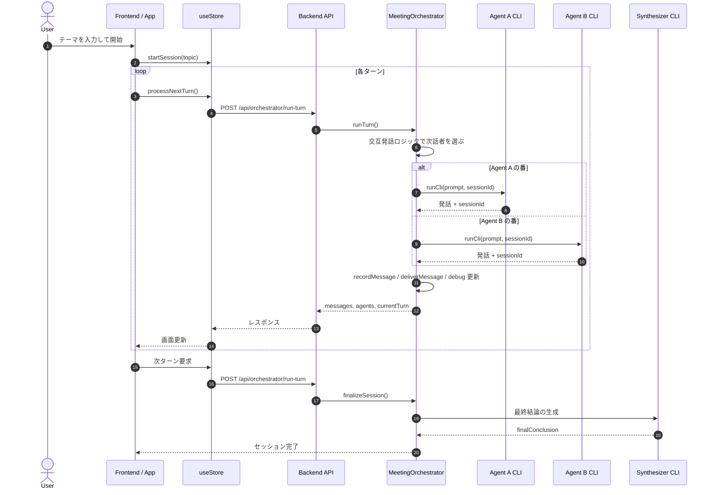
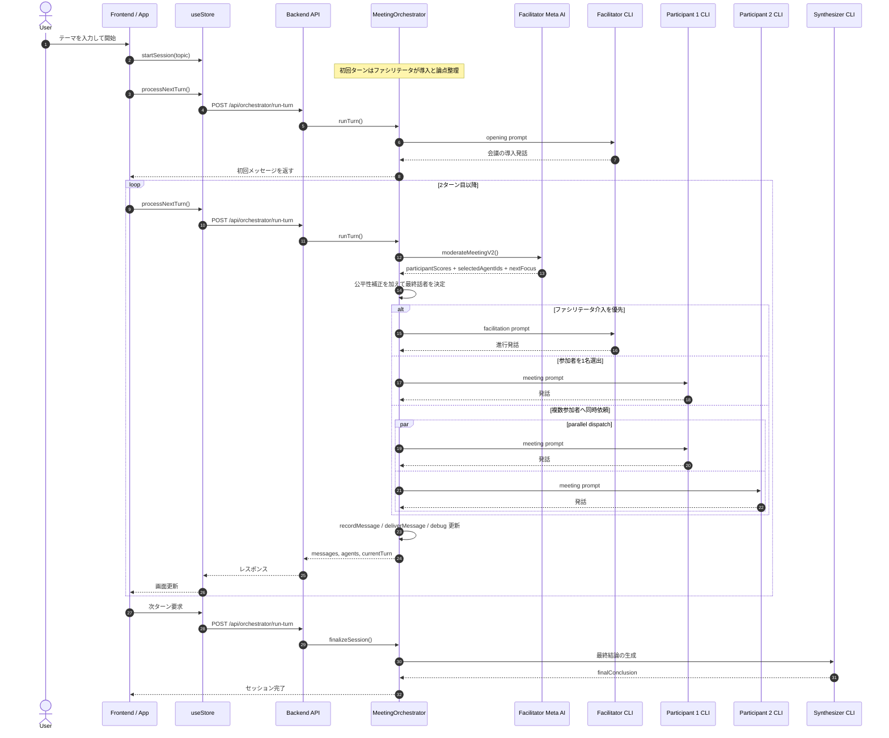
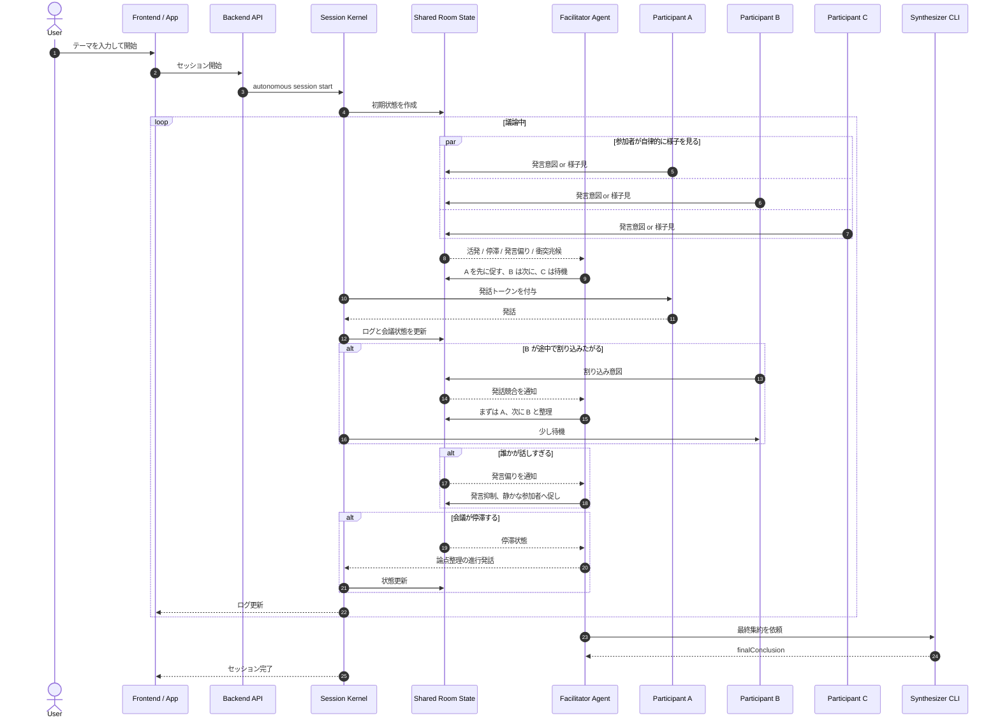

# Turtle Brain Orchestration / Autonomous ガイド

## このガイドの目的

このガイドは、`Orchestration` と将来の `Autonomous` をどう捉えるか、Turtle Brain が会話をどう回しているかを、実装に沿って短く整理したものです。特に次の 3 点を分けて理解できるようにしています。

- `実行モード`: 誰が全体進行を制御するか
- `議論スタイル`: どんな会話形式で進めるか
- `エージェントの役割`: オーケストレータ、ファシリテータ、参加者が何を担当するか

## まず整理

### 実行モード

- `Orchestration`: オーケストレータが各ターンの進行、発言者選定、メッセージ配送、最終集約を管理する現在の標準モードです。
- `Autonomous`: 将来モードです。エージェント自身がより主体的に進行し、中央制御を薄くする想定です。現時点では未実装です。

### 議論スタイル

- `Conversation`: 2 名が交互に会話します。ファシリテータも挙手判定も使いません。
- `Meeting`: 複数エージェントで会議します。ファシリテータが論点整理を行い、オーケストレータが次話者を選びます。

## 役割の違い

### オーケストレータ

- 各ターンの開始と終了を管理します。
- `run-turn` API を受けて、そのターンに誰が話すか最終決定します。
- 会話ログを各エージェントへ配り、`mailbox` を更新します。
- ターン上限に達したら最終結論を生成します。

### ファシリテータ

- `Meeting` のときだけ使います。
- 会議の現状整理、次の焦点、誰に話してほしいかを提案します。
- ただし最終的な発言者決定はファシリテータ単独ではなく、オーケストレータが公平性補正を入れて決めます。

### 参加者

- 直近の発言、ファシリテータの整理、自分のスタンス、性格を踏まえて自然な 1 発言を返します。
- 自分専用の `runtimeSessionId` を持つため、各 AI は自分の会話文脈を持続できます。

## 今回の高速化で何を変えたか

今回の意図は、`Meeting` の自然な会話テイストを壊さずに、発言者選定の待ち時間だけを減らすことでした。現在の実装では、通常の `Orchestration + Meeting` は次のように動きます。

- 進行役 AI への 1 回のメタ判定で、`participantScores`、`selectedAgentIds`、`nextFocus`、`parallelDispatch` をまとめて返します。
- その結果を受けて、オーケストレータが公平性補正を加えて最終的な発言者を決めます。
- そのため、設定画面から `発言者選定方式` の選択肢は外し、通常の `Meeting` はこの AI 判定経路を使う前提にしました。
- 以前のように、参加者ごとに別々の採点用 AI 呼び出しを並べる通常経路は使いません。
- 発言そのものの生成は従来どおり各エージェントの本来のセッションで行うため、会話の流れは保たれます。
- 採点や司会判断のためのメタ判定は別セッションで行うため、本発話用の会話履歴を汚しません。

### Meeting での最終判断は誰がするか

`Meeting` では「ファシリテータが全部決める」わけではありません。実際には次の 2 段階です。

1. ファシリテータ AI が「今の会議状況の整理」と「誰が話すべきかの提案」を返す
2. オーケストレータがそれを受けて、公平性補正や直近発話ペナルティを加えて実際の話者を選ぶ

オーケストレータが見ている代表的な要素は次のとおりです。

- 進行役 AI が返した参加者ごとの発言必要度
- 進行役 AI が明示的に指名した参加者
- 発言回数の偏り
- 直前に話したばかりかどうか
- 進行役自身が介入すべき優先度

このため、現在の `Meeting` は「完全ルールベース」でも「完全にファシリテータ任せ」でもなく、`AI の判断 + オーケストレータの進行制御` です。

## シーケンス図

### Orchestration + Conversation

### Orchestration + Meeting

### Autonomous モードの想定シーケンス

以下は将来構想です。現時点では未実装であり、実際のコードはまだありません。

ここで重要なのは、中央の存在を `隠れたオーケストレータ` と見なさないことです。  
もし将来このモードを実装するなら、中央の存在は `誰が話すかを決める司令塔` ではなく、`会議室の基盤` に近い役割に留めるのが自然です。

- `Session Kernel`: 会議の土台です。共有メモリ、mailbox、発話中フラグ、衝突通知、ログ保存などを担当します。
- `Facilitator`: 会議を回す主体です。誰に先に話してもらうか、停滞時にどう促すか、話しすぎをどう抑えるかを判断します。
- `Participants`: 自分のスタンス、性格、直近の会話、会議の勢いを見て、自律的に発言意図を出します。

つまり Autonomous は、`中央が判断する会議` ではなく、`ファシリテータと参加者が主役で、基盤は交通整理だけをする会議` を目指すものです。

## Orchestration と Autonomous の違い

### Orchestration

- 中央のオーケストレータが毎ターン必ず介入します。
- 誰が話すかの最終決定権はオーケストレータ側にあります。
- `Meeting` ではファシリテータ AI は提案者であり、進行そのものはオーケストレータが管理します。

### Autonomous

- 中央制御を薄くし、各エージェントの自律判断を主役にする想定です。
- ファシリテータが人間の会議に近い形で交通整理を担い、基盤側はログ保存や衝突通知などの下支えに寄ります。
- 進行順や収束判断を、より分散的に決めます。
- 実装方針としては、`会議 OS が強く制御する` から `複数 AI と進行役が相互調整する` へ寄せるイメージです。

## Autonomous をどう捉えると自然か

`Autonomous` を自然に理解するには、`裏の実行者` ではなく、`会議室そのものに近い基盤` と考えるのがよいです。

### これは違う

- 見えないオーケストレータが、裏で毎回「次は誰」と決める
- 中央の基盤が会議の意味や方向性を支配する

### こう考えると近い

- 会議室には空気がある
- 今は活発か、停滞気味か、少し荒れているかがある
- 誰かが被せ気味に話そうとしたら、進行役が制する
- 誰かが話しすぎたら、進行役が別の人に振る
- でも会議内容そのものは参加者とファシリテータが作る

ただしソフトウェアでは、空気感だけでは足りません。実際には最低限の基盤が必要です。

- 共有ログ
- mailbox
- 発話中かどうかの状態
- 割り込みや衝突の検知
- 停滞や偏りの観測
- 終了条件の保持

この最低限の基盤を、ここでは `Session Kernel` と呼んでいます。  
重要なのは、この Kernel は `判断主体` ではなく `会議の土台` であることです。

## 将来の Autonomous の設計方針としてよさそうなもの

ご提案の方向性はかなり筋が良いです。特に次の考え方は、`Autonomous` を `Orchestration` ときれいに差別化できます。

### 1. 進行の主役はファシリテータに寄せる

- 発話順の最終整理
- 被りそうなときの仲裁
- 停滞時の再始動
- 話しすぎへの注意
- 静かな参加者への促し

これはまさに人間の会議に近いです。

### 2. 参加者は「発話要求」を持つ

参加者は毎回必ず話すのではなく、内部的に次のような状態を持つと自然です。

- 今すぐ言いたい
- もう少し様子を見る
- 今の議論には乗りたい
- いったん引く
- 今は割り込むほどではない

この差が、性格やスタンスの違いとして出ます。

### 3. 空気感は共有状態として持つ

ご指摘の `活発 / 停滞 / 順調` はとても重要です。  
これは `Autonomous` の本質にかなり近く、以下のような共有状態として持つとよいです。

- activityLevel: 活発 / 通常 / 停滞
- contentionLevel: 被り気味 / 安定
- balanceLevel: 特定話者に偏っているか
- convergenceLevel: 収束に向かっているか

ただし、これを見て実際にどう振る舞うかはファシリテータや参加者が決めるべきで、Kernel が決めるべきではありません。

### 4. キューは強すぎない方がよい

ここも完全に同意です。  
厳密な FIFO キューにすると、人間らしい会議のゆらぎが消えます。将来の Autonomous は次の程度が自然です。

- 完全キューイングではなく `発言意図の強弱`
- 割り込みは可能だが、ファシリテータが抑制できる
- 少し待つ、今は見る、後で戻る、を許容する
- 発言ペナルティは hard stop ではなく、進行役の注意や選出抑制で効かせる

## いまの Turtle Brain をひとことで言うと

現在の Turtle Brain は、`完全自律会議` ではなく、`オーケストレータ付きの半自律会議` です。  
会話の自然さは各 AI の発話生成に任せつつ、進行の破綻防止と公平性の維持はオーケストレータが引き受けています。
