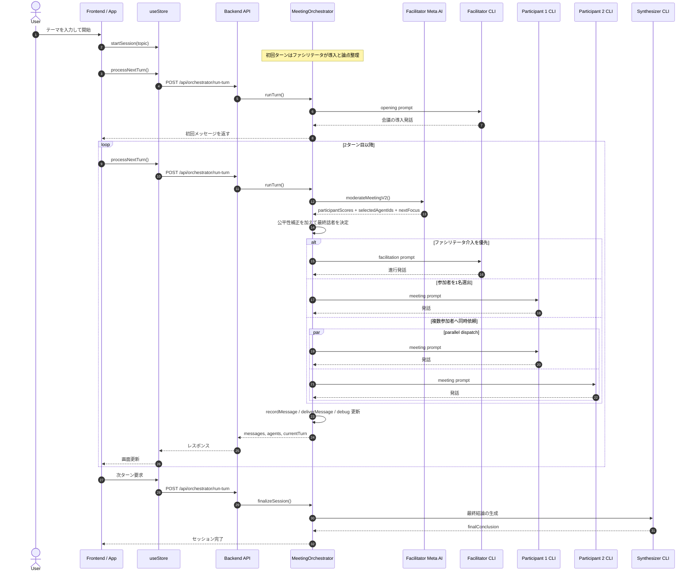
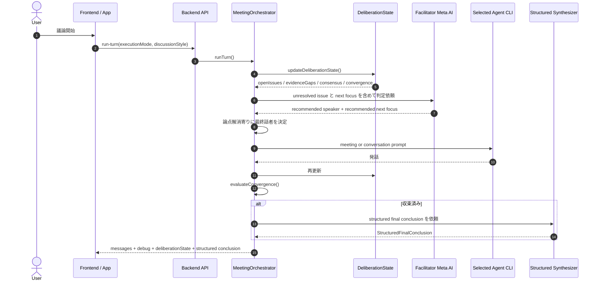
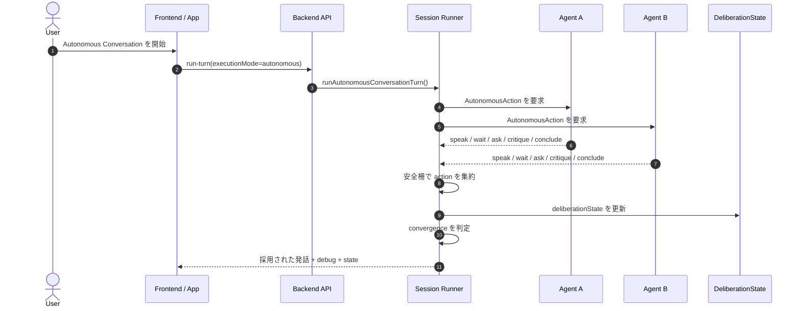

# Turtle Brain Orchestration / Autonomous ガイド

更新日: 2026-05-17

## このガイドの目的

このガイドは、Turtle Brain の `Orchestration` と `Autonomous` を、実装状態と今後の仕様追加の両方を踏まえて整理するためのものです。

特に次の 4 点をひと目で理解できるようにします。

- `実行モード`: 誰が全体進行を主導するか
- `議論スタイル`: どんな会話形式で進めるか
- `現在の実装`: いま本当に動いているものは何か
- `次段階の追加仕様`: 0516 時点で何を足すと「より良い答え」に近づくか

## 先に結論

- 現在の標準モードは `Orchestration` です
- `Conversation` と `Meeting` は実装済みです
- `Autonomous × Conversation` は最小実装済みです
- `Autonomous × Meeting` は将来フェーズであり、現時点では Orchestration × Meeting へフォールバックします
- `議論状態`, `収束判定`, `構造化結論` は 2026-05-16 追加仕様として実装済みです

## まず 2 軸で整理する

### 実行モード

- `Orchestration`: オーケストレータが各ターンの進行、発言者選定、メッセージ配送、最終集約を管理する現在の標準モードです
- `Autonomous`: エージェント自身の行動提案をサーバー側の安全柵で集約するモードです。現時点では Conversation の MVP を実装済みです

### 議論スタイル

- `Conversation`: 2 名が交互に会話します。ファシリテータも挙手判定も使いません
- `Meeting`: 複数エージェントで会議します。ファシリテータが論点整理を行い、オーケストレータが次話者を選びます

### 組み合わせの現状

| 実行モード | Conversation | Meeting |
| --- | --- | --- |
| Orchestration | 実装済み | 実装済み |
| Autonomous | MVP 実装済み | Orchestration へフォールバック |

## 役割の違い

### オーケストレータ

- 各ターンの開始と終了を管理します
- `run-turn` API を受けて、そのターンに誰が話すか最終決定します
- 会話ログを各エージェントへ配り、`mailbox` を更新します
- 現状はターン上限に達したら最終結論を生成します
- 2026-05-16 実装後は `議論状態の更新`, `収束判定`, `構造化結論生成` も担います

### ファシリテータ

- `Meeting` のときだけ使います
- 会議の現状整理、次の焦点、誰に話してほしいかを提案します
- ただし最終的な発言者決定はファシリテータ単独ではなく、オーケストレータが公平性補正を入れて決めます
- 将来の Autonomous × Meeting では、進行の主役をよりファシリテータ寄りにするのが自然です

### 参加者

- 直近の発言、ファシリテータの整理、自分のスタンス、性格を踏まえて自然な 1 発言を返します
- 自分専用の `runtimeSessionId` を持つため、各 AI は自分の会話文脈を持続できます
- 将来の Autonomous では、単に話すだけでなく `話す / 待つ / 問う / 批判する / 結論へ進む` を選べるようにします

## 現在の実装が実際にやっていること

### Orchestration × Conversation

- 2 名の参加者が交互に話します
- 直前の話者と異なる参加者を選ぶシンプルな制御です
- 相手の直近発言、最近の会話、自分の過去発言、inbox を prompt に入れます
- 2〜4 文程度の自然な返答を促します
- まだ「十分に妥当な答えに近づいたか」は判断していません

### Orchestration × Meeting

- 初回はファシリテータが導入と論点整理を行います
- 2 ターン目以降は AI メタ判定またはルールベース評価で発話者候補を出します
- オーケストレータが公平性補正と直近発話ペナルティを加えて最終的な話者を決めます
- 必要ならファシリテータ自身が介入し、必要なら複数参加者を同時に選ぶこともできます

### 現在の Diagnostics

現在の Diagnostics では次の情報が見えます。

- sessionId
- 各エージェントの runtimeSessionId
- dispatch reason
- facilitator の整理と理由
- participant score
- worker 実行時間
- mailbox 状態
- deliberationState
- convergenceDecision
- structured conclusion confidence
- 最新ログ

`openIssues`, `evidenceGaps`, `consensus`, `convergence`, `structured conclusion confidence` を Diagnostics で確認できるため、会話量だけでなく議論品質の進行も追えます。

## 2026-05-16 実装前の限界

0516 の仕様追加が必要になった理由は、主に次の 5 点です。

### 1. executionMode がバックエンド契約に入っていない

フロントには `executionMode` がありますが、run-turn API にはまだ送っていません。そのためサーバは実質 `discussionStyle` のみで分岐しています。

### 2. 議論状態モデルがない

現在は `messages` と `log` はありますが、次を構造的に持っていません。

- 現在の論点
- 主張一覧
- 反対意見
- 未解決事項
- 根拠不足
- 合意レベル
- 収束状態
- 次に検証すべき論点

### 3. 終了条件が固定ターン中心

今は基本的に `turnLimit × agent数` で終わります。これは安全ですが、答えがもう出ていても続き、まだ足りなくても終わります。

### 4. 最終結論が自由文

いまの最終結論は読みやすい一方、見出し揺れに弱く、UI と Markdown export とテストの安定性が低いです。

### 5. 話者選定が公平性中心

現在の Meeting は、発話回数の偏り、スコア、ファシリテータ指名を中心に次話者を決めています。これでは「未解決論点を潰すために誰を呼ぶか」という判断が弱いです。

## 2026-05-16 で追加した考え方

### executionMode を正式な API 契約にする

まず `executionMode` をフロントからサーバへ通し、セッションに保持します。これで `Orchestration` と `Autonomous` を本当に別物として扱えるようになります。

```ts
type ExecutionMode = 'orchestration' | 'autonomous'
```

### StructuredFinalConclusion を導入する

最終結論は自由文ではなく JSON schema を正とします。表示や export は structured を優先し、parse 失敗時だけ自由文へ fallback します。

```ts
interface StructuredFinalConclusion {
  schemaVersion: 1
  title: string
  conclusionSummary: string
  finalAnswer: string
  reasoning: string[]
  supportingPoints: string[]
  counterArguments: string[]
  unresolvedIssues: string[]
  risks: string[]
  confidence: {
    score: number
    reason: string
  }
  nextActions: Array<{
    label: string
    detail: string
    priority: 'high' | 'medium' | 'low'
  }>
}
```

### DeliberationState を導入する

議論の内部状態を持つことで、「会話が続いた」ではなく「答えが改善した」を追えるようにします。

```ts
interface DeliberationState {
  agenda: string[]
  claims: Array<{
    id: string
    text: string
    supportLevel: 'weak' | 'medium' | 'strong'
    challengedBy: string[]
  }>
  openIssues: string[]
  disagreements: string[]
  evidenceGaps: string[]
  consensus: {
    level: number
    summary: string
  }
  convergence: {
    status: 'exploring' | 'debating' | 'needs_verification' | 'ready_to_conclude' | 'blocked'
    reason: string
    confidence: number
    recommendedNextFocus: string | null
  }
}
```

### ConvergenceDecision を導入する

固定ターンだけではなく、議論の状態で終了判断できるようにします。

```ts
interface ConvergenceDecision {
  readyToConclude: boolean
  confidence: number
  reason: string
  remainingIssues: string[]
  nextFocus: string | null
}
```

### AutonomousAction を導入する

Autonomous × Conversation の最小実装では、各エージェントが行動を提案し、サーバが安全柵付きで集約します。

```ts
interface AutonomousAction {
  agentId: string
  action: 'speak' | 'wait' | 'ask' | 'critique' | 'conclude'
  reason: string
  message: string
  confidence: number
}
```

## 次段階のモードごとの姿

### Orchestration はどう変わるか

2026-05-16 実装後の Orchestration は、単に順番を回すだけでなく、次の仕事も持ちます。

- deliberationState を更新する
- convergence を判定する
- unresolved issue と evidence gap をもとに話者を選ぶ
- structured final conclusion を生成する

つまり `会話を回すオーケストレータ` から、`議論品質を制御するオーケストレータ` へ進化させます。

### Autonomous × Conversation はどう作るか

次に実装すべき Autonomous は、まず Conversation に限定するのが安全です。

- 各エージェントは `speak / wait / ask / critique / conclude` を返す
- サーバが空応答、重複応答、同一エージェント連続発話、同じ論点反復を抑止する
- `conclude` が強いときは convergence 判定へ進む

ここでは「完全放任」ではなく、`自律提案 + サーバ安全柵` の構成にします。

### Autonomous × Meeting はどう考えるか

Autonomous × Meeting は、現時点では将来フェーズです。自然な姿は次のとおりです。

- ファシリテータが進行の主役を担う
- 参加者は発話意図の強弱を持つ
- Session Kernel は共有ログ、mailbox、衝突通知、停滞観測などの基盤に徹する
- 中央が毎回「次は誰」と決める司令塔にならない

## シーケンス図

### 現在の Orchestration + Meeting


```mermaid
sequenceDiagram
    autonumber
    actor User as User
    participant UI as Frontend / App
    participant Store as useStore
    participant API as Backend API
    participant Orch as MeetingOrchestrator
    participant FacMeta as Facilitator Meta AI
    participant Fac as Facilitator CLI
    participant P1 as Participant 1 CLI
    participant P2 as Participant 2 CLI
    participant Syn as Synthesizer CLI

    User->>UI: テーマを入力して開始
    UI->>Store: startSession(topic)

    Note over Orch: 初回ターンはファシリテータが導入と論点整理
    UI->>Store: processNextTurn()
    Store->>API: POST /api/orchestrator/run-turn
    API->>Orch: runTurn()
    Orch->>Fac: opening prompt
    Fac-->>Orch: 会議の導入発話
    Orch-->>UI: 初回メッセージを返す

    loop 2ターン目以降
        UI->>Store: processNextTurn()
        Store->>API: POST /api/orchestrator/run-turn
        API->>Orch: runTurn()
        Orch->>FacMeta: moderateMeetingV2()
        FacMeta-->>Orch: participantScores + selectedAgentIds + nextFocus
        Orch->>Orch: 公平性補正を加えて最終話者を決定
        alt ファシリテータ介入を優先
            Orch->>Fac: facilitation prompt
            Fac-->>Orch: 進行発話
        else 参加者を1名選出
            Orch->>P1: meeting prompt
            P1-->>Orch: 発話
        else 複数参加者へ同時依頼
            par parallel dispatch
                Orch->>P1: meeting prompt
                P1-->>Orch: 発話
            and
                Orch->>P2: meeting prompt
                P2-->>Orch: 発話
            end
        end
        Orch->>Orch: recordMessage / deliverMessage / debug 更新
        Orch-->>API: messages, agents, currentTurn
        API-->>Store: レスポンス
        Store-->>UI: 画面更新
    end

    UI->>Store: 次ターン要求
    Store->>API: POST /api/orchestrator/run-turn
    API->>Orch: finalizeSession()
    Orch->>Syn: 最終結論の生成
    Syn-->>Orch: finalConclusion
    Orch-->>UI: セッション完了
```

### 次段階の Orchestration: 議論収束基盤つき


```mermaid
sequenceDiagram
    autonumber
    actor User as User
    participant UI as Frontend / App
    participant API as Backend API
    participant Orch as MeetingOrchestrator
    participant State as DeliberationState
    participant FacMeta as Facilitator Meta AI
    participant Agent as Selected Agent CLI
    participant Syn as Structured Synthesizer

    User->>UI: 議論開始
    UI->>API: run-turn(executionMode, discussionStyle)
    API->>Orch: runTurn()
    Orch->>State: updateDeliberationState()
    State-->>Orch: openIssues / evidenceGaps / consensus / convergence
    Orch->>FacMeta: unresolved issue と next focus を含めて判定依頼
    FacMeta-->>Orch: recommended speaker + recommended next focus
    Orch->>Orch: 論点解消寄りに最終話者を決定
    Orch->>Agent: meeting or conversation prompt
    Agent-->>Orch: 発話
    Orch->>State: 再更新
    Orch->>Orch: evaluateConvergence()
    alt 収束済み
        Orch->>Syn: structured final conclusion を依頼
        Syn-->>Orch: StructuredFinalConclusion
    end
    Orch-->>UI: messages + debug + deliberationState + structured conclusion
```

### Autonomous × Conversation MVP


```mermaid
sequenceDiagram
    autonumber
    actor User as User
    participant UI as Frontend / App
    participant API as Backend API
    participant Orch as Session Runner
    participant A as Agent A
    participant B as Agent B
    participant State as DeliberationState

    User->>UI: Autonomous Conversation を開始
    UI->>API: run-turn(executionMode=autonomous)
    API->>Orch: runAutonomousConversationTurn()
    Orch->>A: AutonomousAction を要求
    Orch->>B: AutonomousAction を要求
    A-->>Orch: speak / wait / ask / critique / conclude
    B-->>Orch: speak / wait / ask / critique / conclude
    Orch->>Orch: 安全柵で action を集約
    Orch->>State: deliberationState を更新
    Orch->>Orch: convergence を判定
    Orch-->>UI: 採用された発話 + debug + state
```

## Diagnostics をどう読むとよいか

### 現在見えているもの

- sessionId: セッション識別子
- runtimeSessionId: 各 CLI の継続文脈
- dispatch reason: なぜこの話者になったか
- facilitator: 会議整理の要約
- scores: 挙手や発話必要度
- workers: どこでどれだけ時間を使ったか

### 2026-05-16 実装で追加されたもの

- `openIssues`: まだ解消されていない論点
- `evidenceGaps`: 根拠が不足している点
- `disagreements`: 争点の残り
- `consensus.level`: どこまで合意したか
- `convergence.status`: いま探索中か、検証中か、結論準備完了か
- `recommendedNextFocus`: 次に詰めるべき論点
- `structured conclusion confidence`: 最終答えの確からしさ

## 2026-05-16 実装済みメモ

- `executionMode` は frontend payload、`RunTurnRequest`、`MeetingSession`、debug response に通しています
- 最終結論は `StructuredFinalConclusion` を優先し、parse 失敗時のみ従来の自由文表示へ fallback します
- 各ターン後に `DeliberationState` を更新し、Diagnostics に未解決論点、根拠不足、対立点、合意度、収束状態を表示します
- `evaluateConvergence` が `readyToConclude && confidence >= 70` を満たす場合、turnLimit 前でも structured final conclusion を生成します
- Meeting の話者選定は、発話回数だけでなく未解決論点、根拠不足、批判・検証・統合の desiredAction を加味します
- Autonomous × Conversation は `AutonomousAction` を各参加者から受け取り、空応答、重複、連続発話を抑制しながら採用発話を決めます
- `lint:app`, `typecheck:app`, `typecheck:server`, `test:server` を追加し、server 側に構造化結論と Autonomous Conversation の回帰テストを置いています

## Orchestration と Autonomous の違いをひとことで言うと

### Orchestration

- 中央のオーケストレータが毎ターン必ず介入します
- 誰が話すかの最終決定権はオーケストレータ側にあります
- 品質向上版では、議論状態と収束判定も中央が管理します

### Autonomous

- 各エージェントの自律判断を主役にします
- ただし完全放任ではなく、サーバ側が安全柵を持ちます
- 会議形式まで進める場合は、ファシリテータと Session Kernel の役割分離が重要になります

## 最後に

いまの Turtle Brain は、`完全自律会議` ではなく、`オーケストレータ付きの半自律会議` です。ここに 0516 の仕様を加えることで、Turtle Brain は「会話ログ生成アプリ」から、「議論を収束させて答えの品質を上げる思考オーケストレーター」へ進みやすくなります。

## 2026-05-17 追加: 視点ロール簡易設定

エージェントには、従来の `stance` と `personality` に加えて `viewpointRoleId`, `viewpointFocus`, `viewpointAvoid` を持たせる。

目的は、ユーザーが細かな性格設計をしなくても、会社組織上の代表的な視点から会話を開始できるようにすること。

標準プリセットは次の 10 種類。

- 経営・事業責任
- 現場・業務運用
- プロジェクト推進
- 顧客・利用者
- 営業・市場
- 技術・専門実務
- 財務・経理
- 人事・組織
- 法務・コンプライアンス・知財
- セキュリティ・リスク管理

会話プロンプトでは、各エージェントに `Viewpoint role`, `Primary viewpoint focus`, `Avoid over-biasing toward` を渡す。ファシリテータと最終結論生成では、各参加者の視点ロールを明示し、視点差分が分かる形で論点・懸念・推奨アクションを整理する。

標準プリセット自体は固定し、ユーザー編集はエージェント単位の `重視する観点` と `避ける振る舞い` で行う。将来的に必要になった場合のみ、プリセットの複製保存やカスタム視点ライブラリを追加する。
